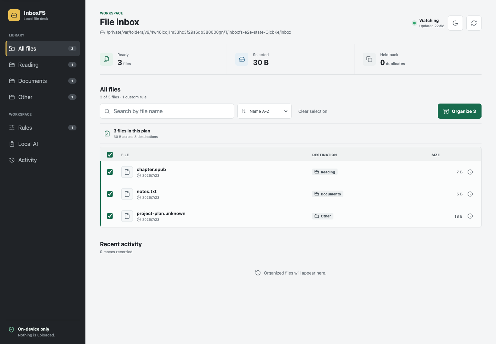
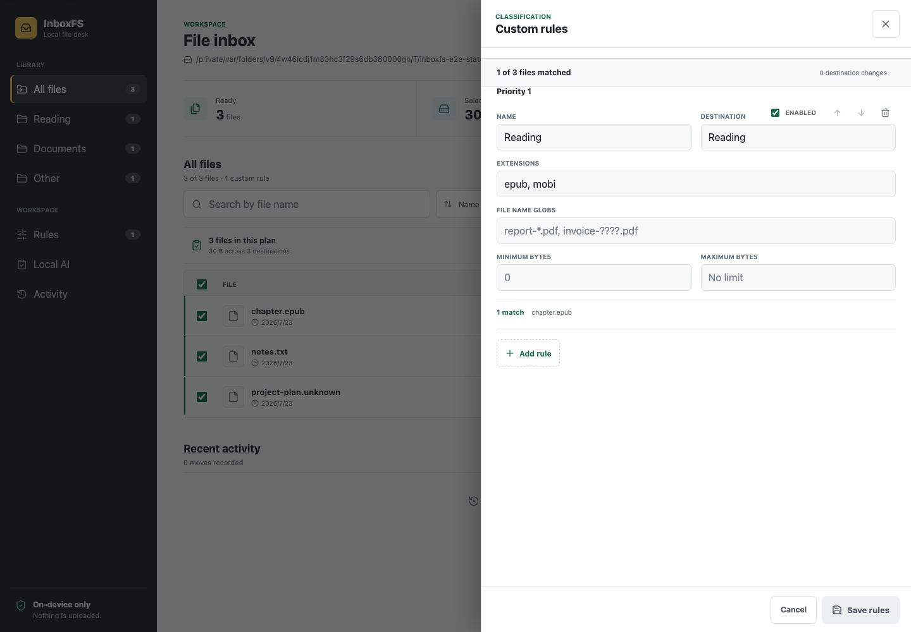
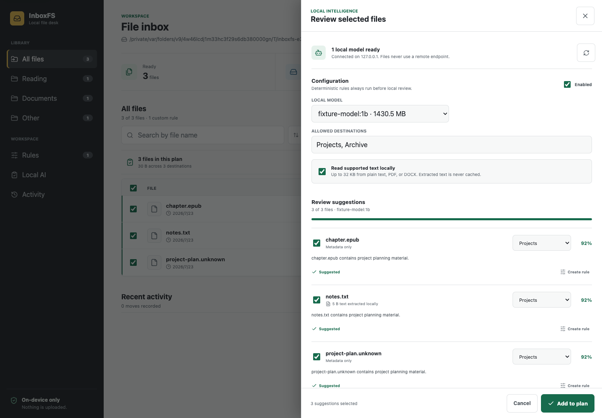

# InboxFS

InboxFS is a local-first file inbox. It scans loose files in a folder, previews clear category destinations, moves only the files you select, and lets you safely undo unchanged moves.

It runs on `127.0.0.1`. File names and contents are not uploaded anywhere.

<picture>
  <source media="(prefers-color-scheme: dark)" srcset="docs/inboxfs-workspace-dark.png">
  
</picture>

## Try it

InboxFS requires Node.js 22.5 or newer.

```bash
npx github:YanhanLi/inboxfs ~/Downloads
```

Your browser opens the local InboxFS workspace. Review the suggestions, deselect anything you want to leave alone, and choose **Organize**.

To scan a different inbox:

```bash
npx github:YanhanLi/inboxfs ~/Desktop
```

## What it does

- categorizes documents, images, audio, video, archives, installers, code/data, fonts, and other files;
- scans only loose regular files in the selected root, leaving subfolders and hidden files alone;
- previews every destination before making changes;
- explains the extension or fallback rule behind every suggested destination;
- sorts suggestions by name, modification time, size, or destination and exposes full details in a keyboard-friendly inspector;
- summarizes each organization plan before files move;
- avoids overwriting existing names by adding a numeric suffix;
- detects byte-identical files in the inbox and existing category folders, leaving later copies unselected;
- refreshes the inbox automatically when loose files are added, renamed, or removed;
- preflights complete batches and rolls earlier moves back if a later move fails;
- records a SHA-256 hash for each move and offers per-file undo;
- refuses undo if the organized file changed or the original location became occupied;
- rejects symbolic-link paths that would leave the selected inbox;
- works in desktop and mobile-width browsers without a cloud account;
- provides keyboard-friendly filters, search, bulk selection, and responsive file views;
- follows the system light or dark theme and remembers manual theme changes locally;
- creates, orders, previews, enables, disables, validates, and removes deterministic multi-condition rules from the responsive workspace.
- optionally reviews unmatched files or an explicit selection with an installed Ollama model on `127.0.0.1`, then lets you accept, correct, or turn suggestions into deterministic rules.

## Custom rules

Choose **Rules** in the workspace to create and edit custom categories. The editor previews match counts, sample files, destination changes, and priority conflicts before anything is saved. Previewing is read-only: it does not move files or rewrite `.inboxfs.json`.

<picture>
  <source media="(prefers-color-scheme: dark)" srcset="docs/inboxfs-rules-dark.png">
  
</picture>

InboxFS validates the complete rule set before atomically saving `.inboxfs.json` in the folder being scanned.
The same versioned file can also be edited directly:

```json
{
  "version": 2,
  "rules": [
    {
      "name": "Large reports",
      "destination": "Reports",
      "enabled": true,
      "match": {
        "extensions": ["pdf"],
        "nameGlobs": ["report-*.pdf"],
        "size": { "minBytes": 1000000 }
      }
    },
    {
      "name": "Reading",
      "destination": "Books",
      "enabled": true,
      "match": { "extensions": ["epub", "mobi"] }
    }
  ]
}
```

Rules are evaluated from top to bottom and the first enabled match wins. Conditions inside one rule are combined with AND; values inside `extensions` or `nameGlobs` are combined with OR. Extensions and bounded `*`/`?` file-name globs are case-insensitive. Globs never match path separators, and arbitrary regular expressions, recursive `**` patterns, and scripts are rejected. Destinations must be single visible folder names without path separators.

Version 1 extension-only files remain supported. The editor reads them without losing rules and writes normalized version 2 only after an explicit save. See [the v1 to v2 migration guide](docs/rules-v2.md) for the complete schema and compatibility behavior.

The workspace watches `.inboxfs.json` for changes. Saving a destination immediately refreshes the preview and invalidates the previous suggestion IDs, so a stale organization plan cannot silently move files using a new rule.

## Local AI preview

Local AI review is optional and disabled by default. Install and run [Ollama](https://ollama.com/), pull a local model, then choose **Local AI** in InboxFS. Select the model, provide two or more allowed destination names, and enable the feature. InboxFS always applies deterministic rules first. Review the remaining unmatched files, or switch to **Selected** to explicitly review the files selected in the workspace.

<picture>
  <source media="(prefers-color-scheme: dark)" srcset="docs/inboxfs-ai-dark.png">
  
</picture>

By default the model receives file name, extension, size, and modification time. Reading supported plain text, PDF, and DOCX is a separate opt-in. Sources are capped at 16 MiB and extracted text at 32 KiB; PDFs stop after eight pages and DOCX reads only the bounded main document XML. Results never move files directly. You review each destination, can correct it, and add selected results to the ordinary organization plan. **Create rule** turns a useful result into an exact-name deterministic rule.

InboxFS talks only to the fixed Ollama origin `http://127.0.0.1:11434`, rejects redirects and cloud-labelled models, and stores private settings and result-only cache files under `~/.inboxfs/`. No endpoint can be configured in the UI or settings file. A locally installed model can still be inaccurate, and a user-created Ollama alias cannot be cryptographically proven to contain no remote behavior. Read the [local AI privacy, evaluation, and threat model](docs/local-ai.md) before enabling text access.

## What it does not do yet

InboxFS does not run OCR, extract images or scanned-PDF text, parse legacy `.doc` files, upload content, execute scripts, monitor subfolders, or learn rules automatically. Local AI review supports metadata and optional bounded plain-text, PDF, and DOCX extraction; it remains advisory until you explicitly add a result to the plan.

Undo history is stored as a private JSON file under `~/.inboxfs/`. Version 0.2 automatically migrates matching v0.1 history to collision-resistant per-directory ledgers. InboxFS is an organizer, not a backup system.

## Development

```bash
git clone https://github.com/YanhanLi/inboxfs.git
cd inboxfs
npm install
npx playwright install chromium
npm run check
npm run dev -- /path/to/a/test-folder --no-open
```

`npm run check` builds the Node server and React interface, runs the filesystem and HTTP safety tests, benchmarks 100 rules, local AI metadata preparation against 10,000 file records, and bounded PDF/DOCX extraction, enforces the 67.12 kB gzip budget for the main JavaScript bundle, and exercises the critical desktop and mobile workflows in Chromium. The browser suite also checks WCAG 2 AA accessibility rules and lazy-chunk recovery.

## Safety model

InboxFS binds to the loopback interface and exposes no cloud service. The server rejects non-loopback Host headers and cross-origin mutations. Mutations are serialized, accept IDs from a fresh scan, and re-scan before moving, which prevents concurrent writes and stale previews from silently applying. The inbox root and destinations are canonicalized before use so history, scans, and mutations share one directory identity; symlink escapes, changed undo targets, and occupied restore paths are rejected.

Duplicate detection first groups candidates by file size and only hashes same-size files, avoiding unnecessary reads for unique sizes. A duplicate is held back rather than deleted; the user remains in control.

Please report vulnerabilities privately as described in [SECURITY.md](SECURITY.md).

## License

[MIT](LICENSE)
